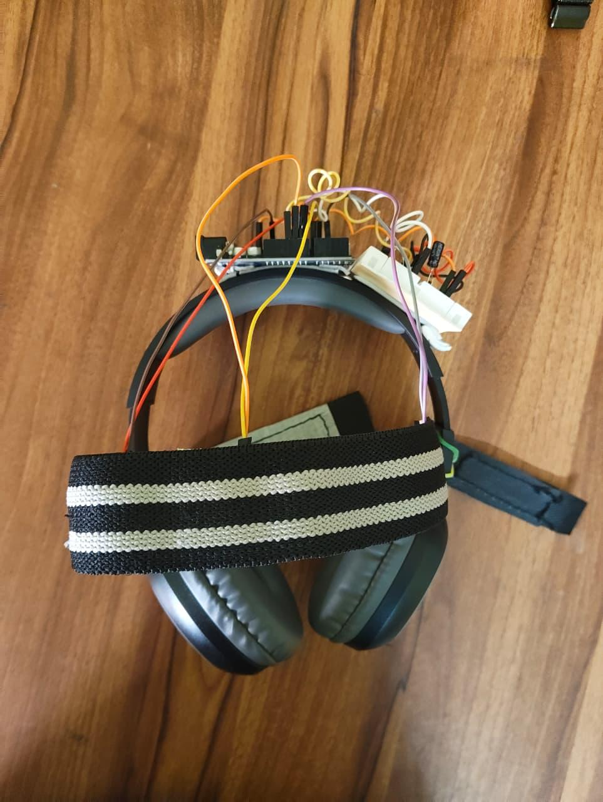
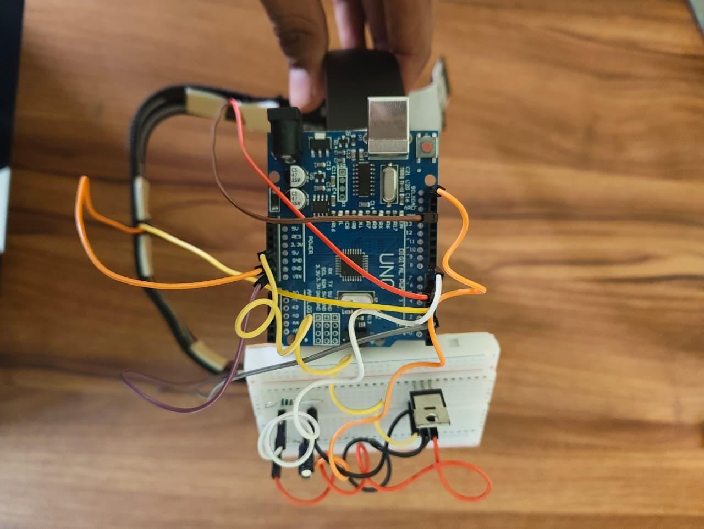

# Multi-Modal Migraine Relief Headset System

## Overview

The Multi-Modal Migraine Relief Headset System is an IoT-based wearable device designed to provide non-invasive migraine relief. The system combines sound therapy, vibration therapy, and guided breathing exercises to reduce stress, muscle tension, and sensory overload.

## Problem Statement

Migraines are commonly caused by stress, muscle tension, and sensory overload. Existing solutions often rely on medication or single-therapy devices that provide limited relief. This project provides a portable and personalized migraine management solution by integrating multiple therapeutic approaches into a single wearable device.

## Features

* Sound Therapy through headphones
* Vibration Therapy using forehead-mounted vibration motors
* Guided 3-4-3 Breathing Exercise
* Web-Based Control Interface
* Real-Time Vibration Control

## Hardware Components

* Arduino Uno
* Vibration Motors
* Headphones
* Breadboard
* Power Supply

## Software Technologies

* HTML
* CSS
* JavaScript
* Node.js
* PHP
* SQL

## System Workflow

1. User enters migraine-related parameters through the web interface.
2. The system generates a personalized therapy session.
3. Guided breathing exercises are initiated.
4. Sound therapy is played through headphones.
5. Arduino controls vibration motors based on user settings.
6. Session data is stored for future reference.

## Project Images

### Prototype Setup

### Headset Prototype

## Future Scope

* AI-Based Personalized Therapy
* EEG Sensor Integration
* Stress and Heart Rate Monitoring
* Mobile Application Support
* Improved Wearable Hardware Design

## Team Members

* Anushka Auti
* Lakshit Barekar
* Tejas Bankar
* Yash Bhandari

## Project Type

Academic IoT and Healthcare Technology Project
